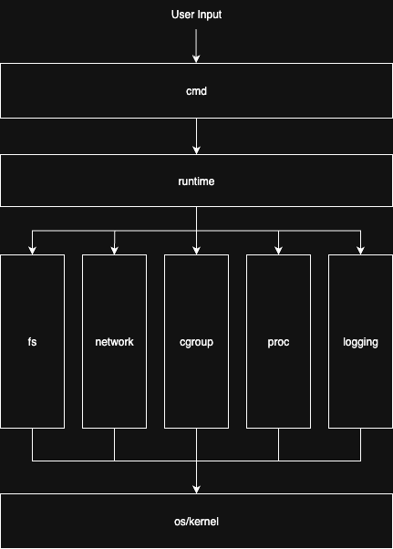

# Architecture Goals

The current architecture and structure of the code is bad and limiting for both maintaining existing code and adding new features. The goal is to refactor the current state so that packages have clear boundaries and enable a clean execution flow. A future state should look similar to this:



A good example of the current state and its ill defined boundaries is the `network.CreateNetNs(command []string, maxCpu, name, ip string, detach bool) (int, *exec.Cmd, error)` function. It has grown way beyond its original scope and now handles networking, logging, process execution, and cgroups. In addition, it takes way too many parameters. 

The goal state is for the `cmd` package to call the `runtime` package as follows (where `spec` is a container object):

```Golang
var runCmd = &cobra.Command{
	Use:   "run",
	Short: "Run a new process in an isolated container",
	Run: func(cmd *cobra.Command, args []string) {
        spec := runtime.NewContainer(cpu, name, detach, ...)
        runtime.Run(spec)
    },
}
```

```Golang
type ContainerSpec struct {
    Name string
    IP net.IP
    CPU CPUConfig
    Ports []PortMapping
    Command []string
}

type Container struct {
    ID string
    PID int
    Spec ContainerSpec
}
```

Then all orchestration efforts move out of the `cmd` package in the `runtime` package, which then calls all other packages as shown above. This should not only clean up code and make feature additions easies but also prevent cyclic dependencies by design.

## Remove raw `ip` & `iptables` calls

After successful refactoring of the current codebase as described above, current invocations of `ip` and `iptables` via `exec.Command(...)` should largely be replaced by e.g. [netlink](https://github.com/vishvananda/netlink).